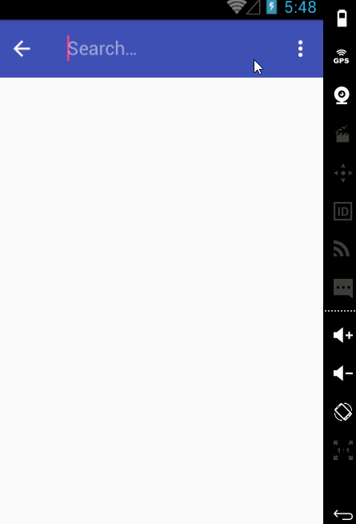

# New_York_Times
An small demo app to complete the homework for week 2. See the Tutorial on our cliffnotes for a step-by-step tutorial.

Time spent: 12 hours implementation (included searching) in total
 - 20/3: 8 hours
 - 21/3: 4 hours
 - 22/3: 1 hours

Implement link: https://github.com/TienVNguyen/Android/tree/master/CoderSchool_VN/Classes/2_Exercise/New_York_Times

App link: https://github.com/TienVNguyen/Android/tree/master/CoderSchool_VN/Classes/2_Exercise/New_York_Times

Completed these requirements:

 * [x]  User can enter a search query that will display a grid of news articles using the thumbnail and headline from the New York Times Search API. (3 points)
 * []  User can click on "settings" which allows selection of advanced search options to filter results. (3 points)
 * []  User can configure advanced search filters such as: (points included above)
        Begin Date (using a date picker)
        News desk values (Arts, Fashion & Style, Sports)
        Sort order (oldest or newest)
 * []  Subsequent searches will have any filters applied to the search results. (1 point)
 * [x]  User can tap on any article in results to view the contents in an embedded browser. (2 points)
 * [x]  User can scroll down "infinitely" to continue loading more news articles. The maximum number of articles is limited by the API search. (1 point)

The following advanced user stories are optional but recommended:

 * [x]  Advanced: Robust error handling, check if internet is available, handle error cases, network failures. (1 point)
 * [x]  Advanced: Use the ActionBar SearchView or custom layout as the query box instead of an EditText. (1 point)
 * []  Advanced: User can share a link to their friends or email it to themselves. (1 point)
 * []  Advanced: Replace Filter Settings Activity with a lightweight modal overlay. (2 points)
 * [x]  Advanced: Improve the user interface and experiment with image assets and/or styling and coloring (1 to 3 points depending on the difficulty of UI improvements)
 * [x]  Bonus: Use the RecyclerView with the StaggeredGridLayoutManager to display improve the grid of image results (see Picasso guide too). (2 points)
 * []  Bonus: For different news articles that only have text or have text with thumbnails, use Heterogenous Layouts with RecyclerView. (2 points)
 * [x]  Bonus: Apply the popular ButterKnife annotation library to reduce view boilerplate. (1 point)
 * []  Bonus: Use Parcelable instead of Serializable using the popular Parceler library. (1 point)
 * [x]  Bonus: Leverage the popular GSON library to streamline the parsing of JSON data. (1 point)
 * [x]  Bonus: Replace Picasso with Glide for more efficient image rendering. (1 point)

 
Notes:

Walkthrough of all functionalities:

